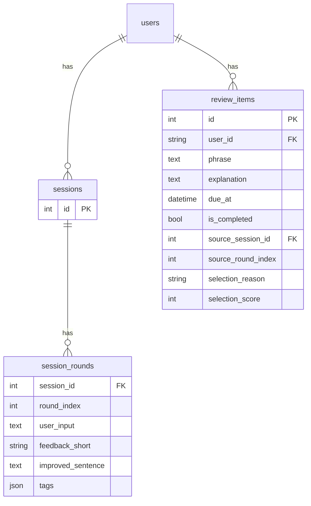
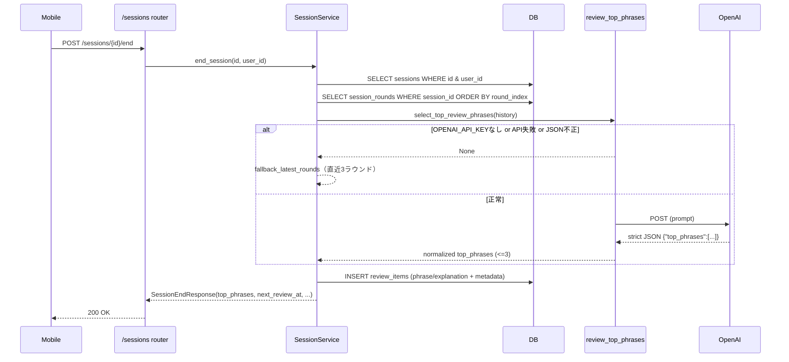

# セッション履歴ベース復習抽出（Top3選定）設計まとめ

## 目的
`POST /sessions/{session_id}/end` 実行時に、セッションの会話履歴（各ラウンドの `improved_sentence` / `feedback_short`）から「復習価値が高いフレーズ最大3件」をAIで選定し、`review_items` に保存する。
`speaking/listening` の復習問題そのものは従来通り `GET /reviews/{review_id}/questions` で遅延生成する。

## 全体アーキテクチャ
- 選定AI: OpenAI（厳密JSON出力）
- 永続化: `review_items`（CloudSQL想定）
- 冪等性: 同一セッションの `end` 再実行時は保存済み `review_items` を返す
- 失敗時: 必ず既存ロジック（直近ラウンド最大3件）へフォールバックし、`/end` を落とさない

```mermaid
flowchart TD
  A[Mobile] -->|POST /sessions/{id}/end| B[FastAPI Router]
  B --> C[SessionService.end_session]
  C -->|会話履歴取得| D[(session_rounds)]
  C -->|AI選定| E[review_top_phrases.select_top_review_phrases]
  E -->|prompt| F[review_top_phrases_selection]
  E -->|HTTP| G[OpenAI]
  C -->|保存| H[(review_items)]
  C -->|レスポンス| A

  A -->|GET /reviews/{review_id}/questions| I[Reviews Router]
  I --> J[ReviewQuestionService]
  J -->|HTTP| G
  J -->|キャッシュ保存| K[(in-memory cache)]
  I -->|問題返却| A
```

## データモデル（CloudSQL変更点）
`review_items` に以下を追加し、「どのセッションのどのラウンド由来で、なぜ選ばれたか」を保存する。

- `source_session_id` (FK -> `sessions.id`, nullable)
- `source_round_index` (int, nullable)
- `selection_reason` (varchar(255), nullable)
- `selection_score` (int, nullable)
- index: `ix_review_items_source_session_id (source_session_id)`
- index: `ix_review_items_user_session (user_id, source_session_id)`



## フロー詳細

### 1) セッション終了時のTop3選定と保存
入口: `POST /sessions/{session_id}/end`

1. `SessionService.end_session` がセッションを終了済みにする（`ended_at` セット）。
2. `SessionRound` を時系列（`round_index asc`）で取得する。
3. `select_top_review_phrases(history)` を呼んでAI選定する。
4. AI失敗時はフォールバックで「直近ラウンド最大3件」を選ぶ。
5. `top_phrases` を `review_items` に保存する（`phrase`/`explanation` に選定結果を格納）。
6. レスポンス `SessionEndResponse.top_phrases` を返す（互換維持のため `List[Dict[str, Any]]`）。



### 2) 冪等性（同一セッションのend再実行）
- セッションが既に終了済みの場合は、`review_items.source_session_id=session_id` の保存済みデータを読み出して返す。
- 保存済みが見つからない場合のみフォールバックする（旧データ互換）。

### 3) 復習問題（speaking/listening）の生成は別タイミング
入口: `GET /reviews/{review_id}/questions`

- DBから `review_items(id, user_id)` を取得する。
- `ReviewQuestionService` が `phrase` / `explanation` を元に speaking と listening をOpenAIで生成する。
- 生成結果の一部を評価用にキャッシュへ保存する（`POST /reviews/{review_id}/evaluate` で参照）。

## AI入出力（Top3選定）

### 入力（各ラウンドから組み立て）
- `round_index`
- `user_input`
- `feedback_short`
- `improved_sentence`
- `tags`

### 出力（厳密JSON）
- `{"top_phrases":[{"round_index":int,"phrase":str,"explanation":str,"reason":str,"score":int}]}`
- `phrase` は `improved_sentence` ベース
- `explanation` は `feedback_short` ベース
- 最大3件、重複除外、`score` 降順

## 障害時ポリシー
- Top3選定AIが失敗しても `POST /sessions/{id}/end` は落とさない。
- 失敗時は必ず「直近ラウンド最大3件」にフォールバックする。

## ログ/監視（想定）
- `session_id`
- `selection_mode`: `ai | fallback | stored`
- `selected_count`
- `fallback_reason`

## 受け入れチェック（手動確認）
- 同じ `session_id` で `/end` を2回呼んでも `top_phrases` が変わらない（stored利用）。
- `review_items` に `source_session_id/source_round_index/selection_reason/selection_score` が入る。
- `GET /reviews/{review_id}/questions` が従来通り生成できる（Top3選定の変更で壊れない）。
