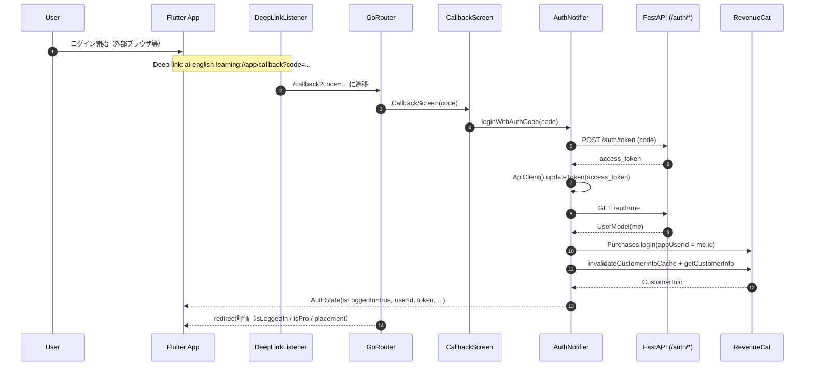
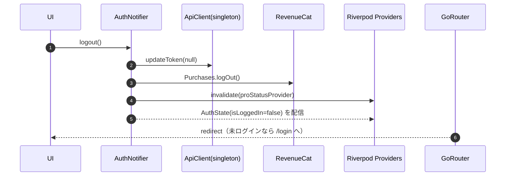

# ログイン / ログアウト フロー図（状態クリアとキャッシュの観点）

## 背景 / 目的

このスレッドで発生した問題:

- ログアウト → 別ユーザーでログインしても、**前ユーザーの復習アイテム / 保存フレーズ等が表示され続ける**

原因は、ユーザー依存データを取得する `FutureProvider` が **ログアウトしてもキャッシュが残り続ける** こと（= 再取得のトリガが無い）でした。

本Issueは、現在の実装に基づいて **ログイン/ログアウトのフロー** と、キャッシュが更新されるポイントを図でまとめます。

---

## 関係ファイル（モバイル）

- `apps/mobile/lib/features/auth/deep_link_listener.dart`
- `apps/mobile/lib/router/app_router.dart`
- `apps/mobile/lib/features/auth/auth_providers.dart`
- `apps/mobile/lib/shared/services/api_client.dart`
- `apps/mobile/lib/features/review/review_screen.dart`
- `apps/mobile/lib/features/rankings/rankings_screen.dart`
- `apps/mobile/lib/features/home/streak_widget.dart`
- `apps/mobile/lib/features/paywall/pro_status_provider.dart`

---

## ログイン（OAuth / Deep Link）フロー（全体）



---

## ログイン（アプリ内部の状態更新ポイント）

```mermaid
flowchart TD
  A[CallbackScreen] --> B[AuthNotifier.loginWithAuthCode]
  B --> C[POST /auth/token]
  C --> D[ApiClient.updateToken(accessToken)]
  D --> E[GET /auth/me]
  E --> F[RevenueCat logIn(me.id)]
  F --> G[proStatusProvider.refresh]
  G --> H[state = AuthState(isLoggedIn=true)]
```

補足:

- `ApiClient` はシングルトンで、`updateToken()` により以後の API 呼び出しに `Authorization: Bearer ...` が付きます。

---

## ログアウト フロー（全体）



---

## ログアウト後に「前ユーザーのデータが残る」問題と、今回の対策

### 問題（発生していたこと）

- `FutureProvider` は取得結果をキャッシュする
- ログアウトしても provider 自体が無効化されない/再評価されないと、**以前の Future 結果が残る**

### 対策（実装したこと）

ユーザー依存の `FutureProvider` 内で `authStateProvider` を `watch` する:

- 認証状態が変わると provider が自動的に再評価される
- 未ログインの場合は `StateError('Not logged in')` を投げ、**過去データを表示し続けない**

対象:

- `ReviewScreen`: `_reviewItemsProvider`, `_reviewStatsProvider`, `_savedPhrasesProvider`
- `RankingsScreen`: `userPointsProvider`, `rankingsProvider`, `myRankingProvider`
- `StreakWidget`: `userStatsProvider`

加えて `logout()` で `proStatusProvider` を `invalidate` して、**前ユーザーのPro状態キャッシュ**もクリアする。

---

## 期待する挙動（受け入れ条件）

- ユーザーAでログイン → 復習/保存フレーズがAの内容になる
- ログアウト → 画面遷移/表示がログイン前状態へ戻る（Aのデータが残らない）
- ユーザーBでログイン → 復習/保存フレーズがBの内容になる

